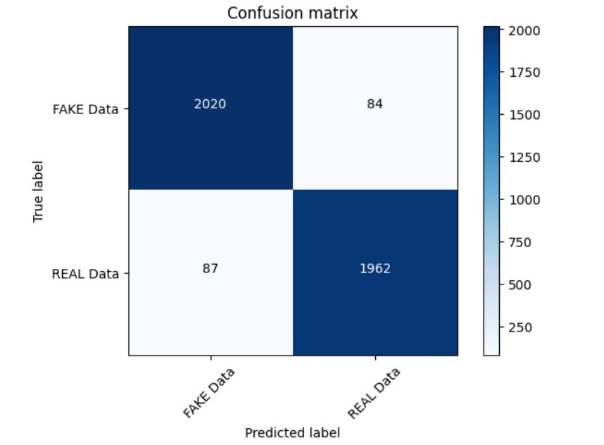

# Fake News Detection using Machine Learning

## Table of Contents
- [Introduction](#introduction)
- [Problem Definition](#problem-definition)
- [Project Structure](#project-structure)
- [Datasets](#datasets)
- [Model Name](#model-name)
- [Images](#images)
- [Prerequisites](#prerequisites)
- [Getting Started](#getting-started)

## Introduction
This repository contains a comprehensive project for detecting fake news using machine learning techniques and various natural language processing techniques. The project includes data analysis, model training, and a web application for real-time fake news detection. The machine learning model is designed to classify news articles as either real or fake based on their content.

## Problem Definition
We aim to develop a machine learning program to identify when a news source may be producing fake news. The model will focus on identifying fake news sources, based on multiple articles originating from a source. Once a source is labeled as a producer of fake news, we can predict with high confidence that any future articles from that source will also be fake news. Focusing on sources widens our article misclassification tolerance, because we will have multiple data points coming from each source.

The intended application of the project is for use in applying visibility weights in social media. Using weights produced by this model, social networks can make stories that are highly likely to be fake news less visible.

## Project Structure
The repository is organized into the following directories and files:
- **Images**: Contains important project images, such as block diagrams, classification reports, confusion matrices, and screenshots.
- **dataset**: Includes the dataset, consisting of train and test data from Kaggle, which is used to train and test the model.
- **static**: Houses static assets for the web application, including CSS, JavaScript, etc.
- **templates**: Includes HTML templates for the web application, such as `Landingpage.html` and `prediction page.html`.
- **Fake_News_Detector-PA.ipynb**: Jupyter Notebook file for data analysis and model training.
- **app.py**: Flask web application for real-time fake news detection.
- **model.pkl**: Pre-trained machine learning model for fake news detection.
- **vector.pkl**: Pre-trained vectorizer for text data.

## Datasets 
### train.csv
A full training dataset with the following attributes:
- `id`: unique id for a news article
- `title`: the title of a news article
- `author`: author of the news article
- `text`: the text of the article; could be incomplete
- `label`: a label that marks the article as potentially unreliable
  - `1`: unreliable
  - `0`: reliable

### test.csv
A testing training dataset with all the same attributes as `train.csv` without the label.

## Model Name
The machine learning model used for fake news detection in this project is the **Passive Aggressive Classifier**.

### Model Description
The Passive Aggressive Classifier (PAC) is a type of online learning algorithm for binary classification tasks. It is well-suited for applications like fake news detection. The PAC algorithm updates its model continuously as new data arrives, making it efficient for real-time classification.

### Model Accuracy
The Passive Aggressive Classifier achieved an impressive accuracy of **96%** during evaluation. This high accuracy indicates its effectiveness in classifying news articles as reliable or unreliable.

The model is pre-trained and available as `model.pkl` in this repository, allowing you to use it for making predictions.

Feel free to explore the Jupyter Notebook (`Fake_News_Detector-PA.ipynb`) for more details about the model's training and performance.

## Images
This section provides visuals and diagrams used in the project:
- Block Diagram


- Process Flow Diagram


- Confusion Matrix


## Prerequisites
Before you begin, ensure you have met the following requirements:
- Python 3.7 or higher
- Install all dependencies from the requirements.txt file.

## Getting Started
To get started with this project, follow these steps:
1. Clone the repository to your local machine:
   ```bash
   git clone https://github.com/abiek12/Fake-News-Detection-using-MachineLearning.git
   ```

2. Create a virtual environment (optional but recommended):
   ```bash
   python -m venv my_env
   ```

3. Activate the virtual environment:
   ```bash
   # On Windows
   .\my_env\Scripts\Activate.ps1
   # On macOS and Linux
   source my_env/bin/activate
   ```

4. Install project dependencies:
   ```bash
   pip install -r requirements.txt
   ```

5. Run the web application:
   ```bash
   python app.py
   ```

Access the application in your web browser by navigating to `http://localhost:5000`.

---

**Author**
- ABHISHEK P P (https://github.com/abiek12)

- If you have any questions or need further assistance, feel free to contact us at abhishekkanichery@gmail.com

---
